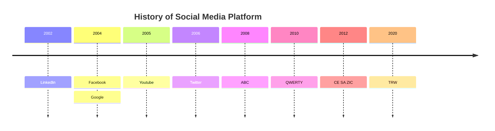
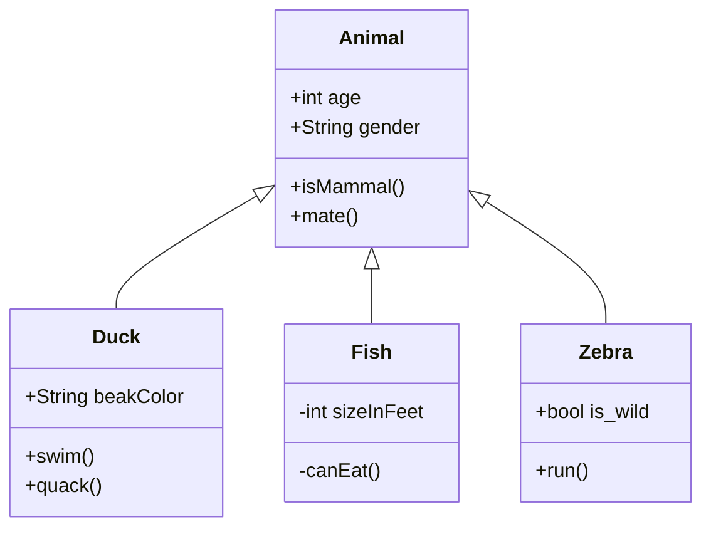

## KeyBindings

| CTRL + Click     | Open link in Edit Mode               |
| ---------------- | ------------------------------------ |
| CTRL + E         | Toggle Edit/Preview                  |
| CTRL + O         | Open Quick Switcher                  |
| CTRL + N         | New Note                             |
| ALT + E          |                                      |
| ALT + N          |                                      |
| CTRL + SHIFT + N |                                      |
| CTRL + O         |                                      |
| FitAllWindow     | Check/UnCheck "Readable line length" |
| CTRL+P           | Command Palette                      |
Daca intr-un link pun '|' pot sa folosesc ca si Alias
Daca intr-un link pun '#' pot linkuiesc direct un anumit header ( merg si mai multe '#') 

| Style                  | Syntax                 | Example                                  | Output                                 |
| ---------------------- | ---------------------- | ---------------------------------------- | -------------------------------------- |
| Bold                   | `** **` or `__ __`     | `**Bold text**`                          | **Bold text**                          |
| Italic                 | `* *` or `_ _`         | `*Italic text*`                          | _Italic text_                          |
| Strikethrough          | `~~ ~~`                | `~~Striked out text~~`                   | ~~Striked out text~~                   |
| Highlight              | == ==                  | = =Highlighted text= =                   | ==Highlighted text==                   |
| Bold and nested italic | `** **` and `_ _`      | `**Bold text and _nested italic_ text**` | **Bold text and _nested italic_ text** |
| Bold and italic        | `*** ***` or `___ ___` | `***Bold and italic text***`             | **_Bold and italic text_**             |
|                        |                        |                                          |                                        |
|                        |                        |                                          |                                        |


[example_linking_without_nodes](obsidian://advanced-uri?vault=Personal&filepath=03%2520-%2520Finance%252FCrypto%252FDe-Fi%252FCrypto%2520Course.md)

# EMBEDS

[CALLOUTS](https://help.obsidian.md/Editing+and+formatting/Callouts)

You can make a callout foldable by adding a plus (+) or a minus (-) directly after the type identifier


```md
>[!]
Si dupa face autoComplete
```

	+
>[!tip]+
this is a tip

	-
>[!note]- 
> This is a not

>[!INFO]
>This is an info.

>[!Danger]
>This is danerous.
Link -> [[05 - Metadata/Test]]
Embedd ->

![[05 - Metadata/Test]]


# Code

`INPUT[text:from_year]`
`INPUT[text:to_year]`

```python
import micropip
await micropip.install('numpy')  
import numpy as np
a = 1
b = 2

def run():
	return a + b
	
	
if __name__ == '__main__':
	res = run()
	print(res)
```


# Other Links to official website

Pot sa revisit in [ObsidianSandbox]

## Formating
**Code blocks**
[Footnotes](obsidian://open?vault=Obsidian%20Sandbox&file=Formatting%2FFootnote)
**Comments**
Charts
[Diagrams/Tables](https://help.obsidian.md/Editing+and+formatting/Advanced+formatting+syntax#:~:text=Content-,Diagram,-You%20can%20address)
[CANVAS](https://help.obsidian.md/Plugins/Canvas)


## Minimal Theme
|Syntax|Description|

- [ ]	to-do
- [/]	incomplete
- [x]	done
- [-]	canceled
- [>]	forwarded
- [<]	scheduling
- [?]	question
- [!]	important
- [*]	star
- ["]	quote
- [l]	location
- [b]	bookmark
- [i]	information
- [S]	savings
- [I]	idea
- [p]	pros
- [c]	cons
- [f]	fire
- [k]	key
- [w]	win
- [u]	up
- [d]	down
  
  

>[!colors]  


# Heading

## Heading
### Heading
#### Heading4
##### Heading5
###### Heading6

Normal Text


**Lorem Ipsum** is simply dummy text of the printing and typesetting industry. *Lorem Ipsum* has been the industry's standard dummy text ever since the 1500s, when an ==unknown printer== took a galley of type and scrambled it to make a type specimen book. It has survived not only five centuries, but also the leap into electronic typesetting, remaining essentially unchanged. It was popularised in the 1960s with the release of Letraset sheets containing Lorem Ipsum passages, and more recently with desktop publishing software like Aldus <u>PageMaker</u> including versions of Lorem Ipsum








## progress bar
[OBSIIAN TUTORIAL PLUGINS](https://obsidianttrpgtutorials.com/Obsidian+TTRPG+Tutorials/Plugin+Tutorials/Dataview/DataviewJS+-+Progress+Bar+on+Tasks)


[PROGRESS BAR](https://forum.obsidian.md/t/progress-bar-from-goals-to-be-automatically-updated-by-calculating-the-percentage-of-completed-tasks-in-the-child-projects-that-are-linked-to-a-parent-goal/41859)


```dataviewjs

// Get the current file name
let filename = dv.current().file.name

// Retrieve all tasks from pages in the specified folder where the 'weekly' field matches the current filename
const tasks = dv.pages('"04 - Journaling/01-Daily"')
               .where(p => p.weekly == filename)
               .file.tasks

// Filter tasks that contain the word 'read'
const readingTasks = tasks.filter(t => t.text.includes("read"))
const analysisTasks = tasks.filter(t => t.text.includes("analysis")); 
const backtestingTasks = tasks.filter(t => t.text.includes("backtest")); 
const journalingTasks = tasks.filter(t => t.text.includes("journal"));

const combinedTasks = [ 
...readingTasks.map(t => ({ type: "Reading", text: t.text, goal: 210 })), 
...backtestingTasks.map(t => ({ type: "Backtesting", text: t.text, goal: 420 })),
...journalingTasks.map(t => ({ type: "Journaling", text: t.text, goal: 1 })) 
...analysisTasks.map(t => ({ type: "Analysis", text: t.text, goal: 1 }))
];

//dv.list(readingTasks)

// Define the goal value for progress (e.g., 210 minutes)
const goal = 210;

// Create a table displaying the task and progress bar
dv.table(["Task", "Progress"], readingTasks.map(task => [
    task.type, 
    `<progress value="${(task.minutes / goal * 100)}" max="100"></progress>` + " " + Math.round(task.minutes / goal * 100) + "% completed"
]));
```

